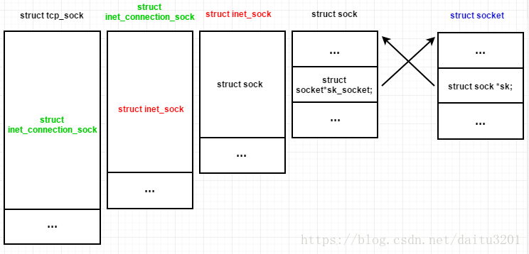
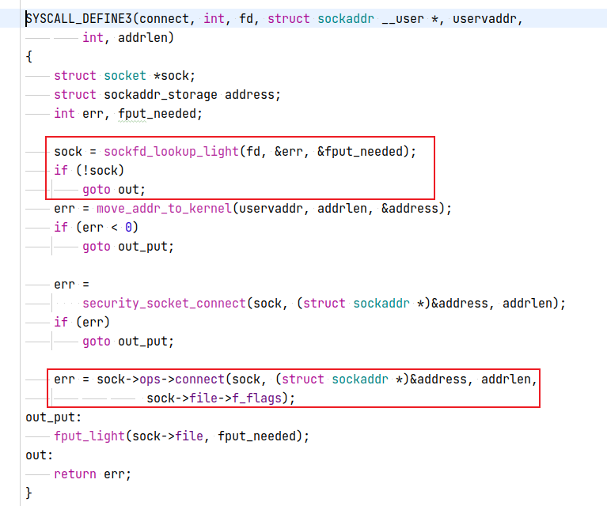
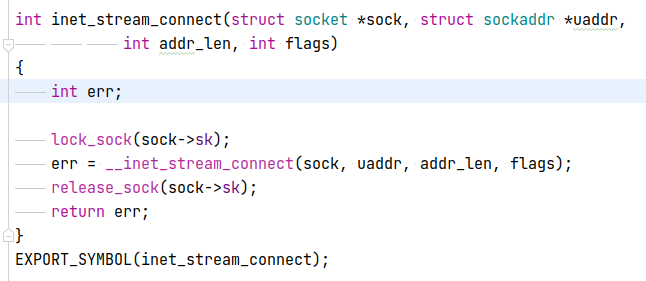
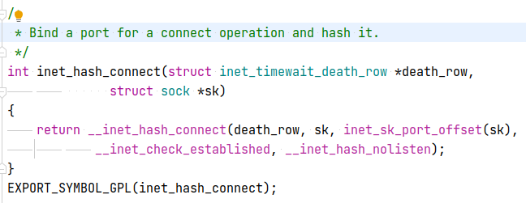
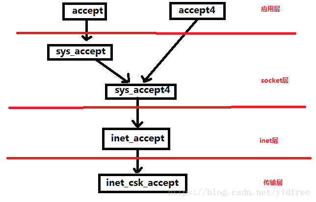
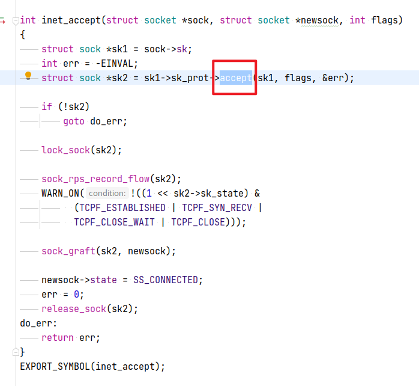
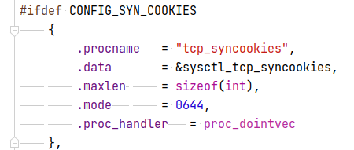

<!-- MDTOC maxdepth:6 firsth1:1 numbering:0 flatten:0 bullets:1 updateOnSave:1 -->

- [理解TCP连接建立过程](#理解tcp连接建立过程)   
   - [sys_listen](#sys_listen)   
   - [sys_connect](#sys_connect)   
   - [sys_accept](#sys_accept)   
   - [tcp_syncookies参数](#tcp_syncookies参数)   

<!-- /MDTOC -->
# 理解TCP连接建立过程


* <https://programmer.ink/think/socket-kernel-data-structure.html>


---

## sys_listen


```
/*
 *	Move a socket into listening state.
 */
int inet_listen(struct socket *sock, int backlog)
{
	struct sock *sk = sock->sk;
	unsigned char old_state;
	int err;

	lock_sock(sk);

	err = -EINVAL;
	if (sock->state != SS_UNCONNECTED || sock->type != SOCK_STREAM)
		goto out;

	old_state = sk->sk_state;
	if (!((1 << old_state) & (TCPF_CLOSE | TCPF_LISTEN)))
		goto out;

	/* Really, if the socket is already in listen state
	 * we can only allow the backlog to be adjusted.
	 */
	if (old_state != TCP_LISTEN) {
		/* Check special setups for testing purpose to enable TFO w/o
		 * requiring TCP_FASTOPEN sockopt.
		 * Note that only TCP sockets (SOCK_STREAM) will reach here.
		 * Also fastopenq may already been allocated because this
		 * socket was in TCP_LISTEN state previously but was
		 * shutdown() (rather than close()).
		 */
		if ((sysctl_tcp_fastopen & TFO_SERVER_ENABLE) != 0 &&
		    inet_csk(sk)->icsk_accept_queue.fastopenq == NULL) {
			if ((sysctl_tcp_fastopen & TFO_SERVER_WO_SOCKOPT1) != 0)
				err = fastopen_init_queue(sk, backlog);
			else if ((sysctl_tcp_fastopen &
				  TFO_SERVER_WO_SOCKOPT2) != 0)
				err = fastopen_init_queue(sk,
				    ((uint)sysctl_tcp_fastopen) >> 16);
			else
				err = 0;
			if (err)
				goto out;
		}
		err = inet_csk_listen_start(sk, backlog); // 关键
		if (err)
			goto out;
	}
	sk->sk_max_ack_backlog = backlog; // 关键
	err = 0;

out:
	release_sock(sk);
	return err;
}
EXPORT_SYMBOL(inet_listen);
```




```
struct inet_connection_sock {
	/* inet_sock has to be the first member! */
	struct inet_sock	  icsk_inet;

	struct request_sock_queue icsk_accept_queue; // 全连接、半连接队列

	struct inet_bind_bucket	  *icsk_bind_hash;
	unsigned long		  icsk_timeout;
 	struct timer_list	  icsk_retransmit_timer;
 	struct timer_list	  icsk_delack_timer;
	__u32			  icsk_rto;
	__u32			  icsk_pmtu_cookie;
	const struct tcp_congestion_ops *icsk_ca_ops;
	const struct inet_connection_sock_af_ops *icsk_af_ops;
	unsigned int		  (*icsk_sync_mss)(struct sock *sk, u32 pmtu);
	__u8			  icsk_ca_state;
	__u8			  icsk_retransmits;
	__u8			  icsk_pending;
	__u8			  icsk_backoff;
	__u8			  icsk_syn_retries;
	__u8			  icsk_probes_out;
	__u16			  icsk_ext_hdr_len;
	struct {
		__u8		  pending;	 /* ACK is pending			   */
		__u8		  quick;	 /* Scheduled number of quick acks	   */
		__u8		  pingpong;	 /* The session is interactive		   */
		__u8		  blocked;	 /* Delayed ACK was blocked by socket lock */
		__u32		  ato;		 /* Predicted tick of soft clock	   */
		unsigned long	  timeout;	 /* Currently scheduled timeout		   */
		__u32		  lrcvtime;	 /* timestamp of last received data packet */
		__u16		  last_seg_size; /* Size of last incoming segment	   */
		__u16		  rcv_mss;	 /* MSS used for delayed ACK decisions	   */
	} icsk_ack;
	struct {
		int		  enabled;

		/* Range of MTUs to search */
		int		  search_high;
		int		  search_low;

		/* Information on the current probe. */
		int		  probe_size;
	} icsk_mtup;
	u32			  icsk_ca_priv[16];
	u32			  icsk_user_timeout;
#define ICSK_CA_PRIV_SIZE	(16 * sizeof(u32))
};
```


## sys_connect






```
/*
 *	Connect to a remote host. There is regrettably still a little
 *	TCP 'magic' in here.
 */
int __inet_stream_connect(struct socket *sock, struct sockaddr *uaddr,
			  int addr_len, int flags)
{
	struct sock *sk = sock->sk;
	int err;
	long timeo;

	if (addr_len < sizeof(uaddr->sa_family))
		return -EINVAL;

	if (uaddr->sa_family == AF_UNSPEC) {
		err = sk->sk_prot->disconnect(sk, flags);
		sock->state = err ? SS_DISCONNECTING : SS_UNCONNECTED;
		goto out;
	}

	switch (sock->state) {
	default:
		err = -EINVAL;
		goto out;
	case SS_CONNECTED:
		err = -EISCONN;
		goto out;
	case SS_CONNECTING:
		err = -EALREADY;
		/* Fall out of switch with err, set for this state */
		break;
	case SS_UNCONNECTED: # 未建立连接
		err = -EISCONN;
		if (sk->sk_state != TCP_CLOSE)
			goto out;

		err = sk->sk_prot->connect(sk, uaddr, addr_len);
		if (err < 0)
			goto out;

		sock->state = SS_CONNECTING;

		/* Just entered SS_CONNECTING state; the only
		 * difference is that return value in non-blocking
		 * case is EINPROGRESS, rather than EALREADY.
		 */
		err = -EINPROGRESS;
		break;
	}

	timeo = sock_sndtimeo(sk, flags & O_NONBLOCK);

	if ((1 << sk->sk_state) & (TCPF_SYN_SENT | TCPF_SYN_RECV)) {
		int writebias = (sk->sk_protocol == IPPROTO_TCP) &&
				tcp_sk(sk)->fastopen_req &&
				tcp_sk(sk)->fastopen_req->data ? 1 : 0;

		/* Error code is set above */
		if (!timeo || !inet_wait_for_connect(sk, timeo, writebias))
			goto out;

		err = sock_intr_errno(timeo);
		if (signal_pending(current))
			goto out;
	}

	/* Connection was closed by RST, timeout, ICMP error
	 * or another process disconnected us.
	 */
	if (sk->sk_state == TCP_CLOSE)
		goto sock_error;

	/* sk->sk_err may be not zero now, if RECVERR was ordered by user
	 * and error was received after socket entered established state.
	 * Hence, it is handled normally after connect() return successfully.
	 */

	sock->state = SS_CONNECTED;
	err = 0;
out:
	return err;

sock_error:
	err = sock_error(sk) ? : -ECONNABORTED;
	sock->state = SS_UNCONNECTED;
	if (sk->sk_prot->disconnect(sk, flags))
		sock->state = SS_DISCONNECTING;
	goto out;
}
EXPORT_SYMBOL(__inet_stream_connect);
```

```err = sk->sk_prot->connect(sk, uaddr, addr_len);```多态，跳转到tcp_v4_connect

```
/* This will initiate an outgoing connection. */
int tcp_v4_connect(struct sock *sk, struct sockaddr *uaddr, int addr_len)
{
	struct sockaddr_in *usin = (struct sockaddr_in *)uaddr;
	struct inet_sock *inet = inet_sk(sk);
	struct tcp_sock *tp = tcp_sk(sk);
	__be16 orig_sport, orig_dport;
	__be32 daddr, nexthop;
	struct flowi4 *fl4;
	struct rtable *rt;
	int err;
	struct ip_options_rcu *inet_opt;

	if (addr_len < sizeof(struct sockaddr_in))
		return -EINVAL;

	if (usin->sin_family != AF_INET)
		return -EAFNOSUPPORT;

	nexthop = daddr = usin->sin_addr.s_addr;
	inet_opt = rcu_dereference_protected(inet->inet_opt,
					     sock_owned_by_user(sk));
	if (inet_opt && inet_opt->opt.srr) {
		if (!daddr)
			return -EINVAL;
		nexthop = inet_opt->opt.faddr;
	}

	orig_sport = inet->inet_sport;
	orig_dport = usin->sin_port;
	fl4 = &inet->cork.fl.u.ip4;
	rt = ip_route_connect(fl4, nexthop, inet->inet_saddr,
			      RT_CONN_FLAGS(sk), sk->sk_bound_dev_if,
			      IPPROTO_TCP,
			      orig_sport, orig_dport, sk, true);
	if (IS_ERR(rt)) {
		err = PTR_ERR(rt);
		if (err == -ENETUNREACH)
			IP_INC_STATS_BH(sock_net(sk), IPSTATS_MIB_OUTNOROUTES);
		return err;
	}

	if (rt->rt_flags & (RTCF_MULTICAST | RTCF_BROADCAST)) {
		ip_rt_put(rt);
		return -ENETUNREACH;
	}

	if (!inet_opt || !inet_opt->opt.srr)
		daddr = fl4->daddr;

	if (!inet->inet_saddr)
		inet->inet_saddr = fl4->saddr;
	inet->inet_rcv_saddr = inet->inet_saddr;

	if (tp->rx_opt.ts_recent_stamp && inet->inet_daddr != daddr) {
		/* Reset inherited state */
		tp->rx_opt.ts_recent	   = 0;
		tp->rx_opt.ts_recent_stamp = 0;
		if (likely(!tp->repair))
			tp->write_seq	   = 0;
	}

	if (tcp_death_row.sysctl_tw_recycle &&
	    !tp->rx_opt.ts_recent_stamp && fl4->daddr == daddr)
		tcp_fetch_timewait_stamp(sk, &rt->dst);

	inet->inet_dport = usin->sin_port;
	inet->inet_daddr = daddr;

	inet_csk(sk)->icsk_ext_hdr_len = 0;
	if (inet_opt)
		inet_csk(sk)->icsk_ext_hdr_len = inet_opt->opt.optlen;

	tp->rx_opt.mss_clamp = TCP_MSS_DEFAULT;

	/* Socket identity is still unknown (sport may be zero).
	 * However we set state to SYN-SENT and not releasing socket
	 * lock select source port, enter ourselves into the hash tables and
	 * complete initialization after this.
	 */
	tcp_set_state(sk, TCP_SYN_SENT);
	err = inet_hash_connect(&tcp_death_row, sk);
	if (err)
		goto failure;

	rt = ip_route_newports(fl4, rt, orig_sport, orig_dport,
			       inet->inet_sport, inet->inet_dport, sk);
	if (IS_ERR(rt)) {
		err = PTR_ERR(rt);
		rt = NULL;
		goto failure;
	}
	/* OK, now commit destination to socket.  */
	sk->sk_gso_type = SKB_GSO_TCPV4;
	sk_setup_caps(sk, &rt->dst);

	if (!tp->write_seq && likely(!tp->repair))
		tp->write_seq = secure_tcp_sequence_number(inet->inet_saddr,
							   inet->inet_daddr,
							   inet->inet_sport,
							   usin->sin_port);

	inet->inet_id = tp->write_seq ^ jiffies;

	err = tcp_connect(sk);

	rt = NULL;
	if (err)
		goto failure;

	return 0;

failure:
	/*
	 * This unhashes the socket and releases the local port,
	 * if necessary.
	 */
	tcp_set_state(sk, TCP_CLOSE);
	ip_rt_put(rt);
	sk->sk_route_caps = 0;
	inet->inet_dport = 0;
	return err;
}
EXPORT_SYMBOL(tcp_v4_connect);
```

* 先修改状态，再选取动态端口，然后发送SYN包

```
enum {
	TCP_ESTABLISHED = 1,
	TCP_SYN_SENT,
	TCP_SYN_RECV,
	TCP_FIN_WAIT1,
	TCP_FIN_WAIT2,
	TCP_TIME_WAIT,
	TCP_CLOSE,
	TCP_CLOSE_WAIT,
	TCP_LAST_ACK,
	TCP_LISTEN,
	TCP_CLOSING,	/* Now a valid state */

	TCP_MAX_STATES	/* Leave at the end! */
};
```


```
void tcp_set_state(struct sock *sk, int state)
{
	int oldstate = sk->sk_state;

	switch (state) {
	case TCP_ESTABLISHED:
		if (oldstate != TCP_ESTABLISHED)
			TCP_INC_STATS(sock_net(sk), TCP_MIB_CURRESTAB);
		break;

	case TCP_CLOSE:
		if (oldstate == TCP_CLOSE_WAIT || oldstate == TCP_ESTABLISHED)
			TCP_INC_STATS(sock_net(sk), TCP_MIB_ESTABRESETS);

		sk->sk_prot->unhash(sk);
		if (inet_csk(sk)->icsk_bind_hash &&
		    !(sk->sk_userlocks & SOCK_BINDPORT_LOCK))
			inet_put_port(sk);
		/* fall through */
	default:
		if (oldstate == TCP_ESTABLISHED)
			TCP_DEC_STATS(sock_net(sk), TCP_MIB_CURRESTAB);
	}

	/* Change state AFTER socket is unhashed to avoid closed
	 * socket sitting in hash tables.
	 */
	sk->sk_state = state;

#ifdef STATE_TRACE
	SOCK_DEBUG(sk, "TCP sk=%p, State %s -> %s\n", sk, statename[oldstate], statename[state]);
#endif
}
EXPORT_SYMBOL_GPL(tcp_set_state);
```




```
int __inet_hash_connect(struct inet_timewait_death_row *death_row,
		struct sock *sk, u32 port_offset,
		int (*check_established)(struct inet_timewait_death_row *,
			struct sock *, __u16, struct inet_timewait_sock **),
		int (*hash)(struct sock *sk, struct inet_timewait_sock *twp))
{
	struct inet_hashinfo *hinfo = death_row->hashinfo;
	const unsigned short snum = inet_sk(sk)->inet_num;
	struct inet_bind_hashbucket *head;
	struct inet_bind_bucket *tb;
	int ret;
	struct net *net = sock_net(sk);
	int twrefcnt = 1;

	if (!snum) {
		int i, remaining, low, high, port;
		static u32 hint;
		u32 offset = hint + port_offset;
		struct inet_timewait_sock *tw = NULL;

		inet_get_local_port_range(&low, &high);
		remaining = (high - low) + 1;

		local_bh_disable();
		for (i = 1; i <= remaining; i++) {
			port = low + (i + offset) % remaining;
			if (inet_is_reserved_local_port(port))
				continue;
			head = &hinfo->bhash[inet_bhashfn(net, port,
					hinfo->bhash_size)];
			spin_lock(&head->lock);

			/* Does not bother with rcv_saddr checks,
			 * because the established check is already
			 * unique enough.
			 */
			inet_bind_bucket_for_each(tb, &head->chain) {
				if (net_eq(ib_net(tb), net) &&
				    tb->port == port) {
					if (tb->fastreuse >= 0 ||
					    tb->fastreuseport >= 0)
						goto next_port;
					WARN_ON(hlist_empty(&tb->owners));
					if (!check_established(death_row, sk,
								port, &tw))
						goto ok;
					goto next_port;
				}
			}

			tb = inet_bind_bucket_create(hinfo->bind_bucket_cachep,
					net, head, port);
			if (!tb) {
				spin_unlock(&head->lock);
				break;
			}
			tb->fastreuse = -1;
			tb->fastreuseport = -1;
			goto ok;

		next_port:
			spin_unlock(&head->lock);
		}
		local_bh_enable();

		return -EADDRNOTAVAIL;

ok:
		hint += i;

		/* Head lock still held and bh's disabled */
		inet_bind_hash(sk, tb, port);
		if (sk_unhashed(sk)) {
			inet_sk(sk)->inet_sport = htons(port);
			twrefcnt += hash(sk, tw);
		}
		if (tw)
			twrefcnt += inet_twsk_bind_unhash(tw, hinfo);
		spin_unlock(&head->lock);

		if (tw) {
			inet_twsk_deschedule(tw, death_row);
			while (twrefcnt) {
				twrefcnt--;
				inet_twsk_put(tw);
			}
		}

		ret = 0;
		goto out;
	}

	head = &hinfo->bhash[inet_bhashfn(net, snum, hinfo->bhash_size)];
	tb  = inet_csk(sk)->icsk_bind_hash;
	spin_lock_bh(&head->lock);
	if (sk_head(&tb->owners) == sk && !sk->sk_bind_node.next) {
		hash(sk, NULL);
		spin_unlock_bh(&head->lock);
		return 0;
	} else {
		spin_unlock(&head->lock);
		/* No definite answer... Walk to established hash table */
		ret = check_established(death_row, sk, snum, NULL);
out:
		local_bh_enable();
		return ret;
	}
}
```

检查端口是否可用

```
/* called with local bh disabled */
static int __inet_check_established(struct inet_timewait_death_row *death_row,
				    struct sock *sk, __u16 lport,
				    struct inet_timewait_sock **twp)
{
	struct inet_hashinfo *hinfo = death_row->hashinfo;
	struct inet_sock *inet = inet_sk(sk);
	__be32 daddr = inet->inet_rcv_saddr;
	__be32 saddr = inet->inet_daddr;
	int dif = sk->sk_bound_dev_if;
	INET_ADDR_COOKIE(acookie, saddr, daddr)
	const __portpair ports = INET_COMBINED_PORTS(inet->inet_dport, lport);
	struct net *net = sock_net(sk);
	unsigned int hash = inet_ehashfn(net, daddr, lport,
					 saddr, inet->inet_dport);
	struct inet_ehash_bucket *head = inet_ehash_bucket(hinfo, hash);
	spinlock_t *lock = inet_ehash_lockp(hinfo, hash);
	struct sock *sk2;
	const struct hlist_nulls_node *node;
	struct inet_timewait_sock *tw;
	int twrefcnt = 0;

	spin_lock(lock);

	/* Check TIME-WAIT sockets first. */
	sk_nulls_for_each(sk2, node, &head->twchain) {
		if (sk2->sk_hash != hash)
			continue;

		if (likely(INET_TW_MATCH(sk2, net, acookie,
					 saddr, daddr, ports, dif))) {
			tw = inet_twsk(sk2);
			if (twsk_unique(sk, sk2, twp))
				goto unique;
			else
				goto not_unique;
		}
	}
	tw = NULL;

	/* And established part... */
	sk_nulls_for_each(sk2, node, &head->chain) {
		if (sk2->sk_hash != hash)
			continue;
		if (likely(INET_MATCH(sk2, net, acookie,
				      saddr, daddr, ports, dif)))
			goto not_unique;
	}

unique:
	/* Must record num and sport now. Otherwise we will see
	 * in hash table socket with a funny identity. */
	inet->inet_num = lport;
	inet->inet_sport = htons(lport);
	sk->sk_hash = hash;
	WARN_ON(!sk_unhashed(sk));
	__sk_nulls_add_node_rcu(sk, &head->chain);
	if (tw) {
		twrefcnt = inet_twsk_unhash(tw);
		NET_INC_STATS_BH(net, LINUX_MIB_TIMEWAITRECYCLED);
	}
	spin_unlock(lock);
	if (twrefcnt)
		inet_twsk_put(tw);
	sock_prot_inuse_add(sock_net(sk), sk->sk_prot, 1);

	if (twp) {
		*twp = tw;
	} else if (tw) {
		/* Silly. Should hash-dance instead... */
		inet_twsk_deschedule(tw, death_row);

		inet_twsk_put(tw);
	}
	return 0;

not_unique:
	spin_unlock(lock);
	return -EADDRNOTAVAIL;
}
```

```
/* Build a SYN and send it off. */
int tcp_connect(struct sock *sk)
{
	struct tcp_sock *tp = tcp_sk(sk);
	struct sk_buff *buff;
	int err;

	tcp_connect_init(sk);

	if (unlikely(tp->repair)) {
		tcp_finish_connect(sk, NULL);
		return 0;
	}

	buff = alloc_skb_fclone(MAX_TCP_HEADER + 15, sk->sk_allocation);
	if (unlikely(buff == NULL))
		return -ENOBUFS;

	/* Reserve space for headers. */
	skb_reserve(buff, MAX_TCP_HEADER);

	tcp_init_nondata_skb(buff, tp->write_seq++, TCPHDR_SYN);
	tp->retrans_stamp = TCP_SKB_CB(buff)->when = tcp_time_stamp;
	tcp_connect_queue_skb(sk, buff);
	TCP_ECN_send_syn(sk, buff);

	/* Send off SYN; include data in Fast Open. */
	err = tp->fastopen_req ? tcp_send_syn_data(sk, buff) :
	      tcp_transmit_skb(sk, buff, 1, sk->sk_allocation);
	if (err == -ECONNREFUSED)
		return err;

	/* We change tp->snd_nxt after the tcp_transmit_skb() call
	 * in order to make this packet get counted in tcpOutSegs.
	 */
	tp->snd_nxt = tp->write_seq;
	tp->pushed_seq = tp->write_seq;
	TCP_INC_STATS(sock_net(sk), TCP_MIB_ACTIVEOPENS);

	/* Timer for repeating the SYN until an answer. */
	inet_csk_reset_xmit_timer(sk, ICSK_TIME_RETRANS,
				  inet_csk(sk)->icsk_rto, TCP_RTO_MAX);
	return 0;
}
EXPORT_SYMBOL(tcp_connect);
```

```
/* Build a SYN and send it off. */
int tcp_connect(struct sock *sk)
{
	struct tcp_sock *tp = tcp_sk(sk);
	struct sk_buff *buff;
	int err;

	tcp_connect_init(sk);

	if (unlikely(tp->repair)) {
		tcp_finish_connect(sk, NULL);
		return 0;
	}

	buff = alloc_skb_fclone(MAX_TCP_HEADER + 15, sk->sk_allocation);
	if (unlikely(buff == NULL))
		return -ENOBUFS;

	/* Reserve space for headers. */
	skb_reserve(buff, MAX_TCP_HEADER);

	tcp_init_nondata_skb(buff, tp->write_seq++, TCPHDR_SYN);
	tp->retrans_stamp = TCP_SKB_CB(buff)->when = tcp_time_stamp;
	tcp_connect_queue_skb(sk, buff);
	TCP_ECN_send_syn(sk, buff);

	/* Send off SYN; include data in Fast Open. */
	err = tp->fastopen_req ? tcp_send_syn_data(sk, buff) :
	      tcp_transmit_skb(sk, buff, 1, sk->sk_allocation);
	if (err == -ECONNREFUSED)
		return err;

	/* We change tp->snd_nxt after the tcp_transmit_skb() call
	 * in order to make this packet get counted in tcpOutSegs.
	 */
	tp->snd_nxt = tp->write_seq;
	tp->pushed_seq = tp->write_seq;
	TCP_INC_STATS(sock_net(sk), TCP_MIB_ACTIVEOPENS);

	/* Timer for repeating the SYN until an answer. */
	inet_csk_reset_xmit_timer(sk, ICSK_TIME_RETRANS,
				  inet_csk(sk)->icsk_rto, TCP_RTO_MAX);
	return 0;
}
EXPORT_SYMBOL(tcp_connect);
```

```
#define TCP_TIMEOUT_INIT ((unsigned)(1*HZ))	/* RFC6298 2.1 initial RTO value	*/
#define TCP_TIMEOUT_FALLBACK ((unsigned)(3*HZ))	/* RFC 1122 initial RTO value, now
						 * used as a fallback RTO for the
						 * initial data transmission if no
						 * valid RTT sample has been acquired,
						 * most likely due to retrans in 3WHS.
						 */
```


## sys_accept







```
/*
 * This will accept the next outstanding connection.
 */
struct sock *inet_csk_accept(struct sock *sk, int flags, int *err)
{
	struct inet_connection_sock *icsk = inet_csk(sk);
	struct request_sock_queue *queue = &icsk->icsk_accept_queue;
	struct sock *newsk;
	struct request_sock *req;
	int error;

	lock_sock(sk);

	/* We need to make sure that this socket is listening,
	 * and that it has something pending.
	 */
	error = -EINVAL;
	if (sk->sk_state != TCP_LISTEN)
		goto out_err;

	/* Find already established connection */
	if (reqsk_queue_empty(queue)) {
		long timeo = sock_rcvtimeo(sk, flags & O_NONBLOCK);

		/* If this is a non blocking socket don't sleep */
		error = -EAGAIN;
		if (!timeo)
			goto out_err;

		error = inet_csk_wait_for_connect(sk, timeo);
		if (error)
			goto out_err;
	}
	req = reqsk_queue_remove(queue);
	newsk = req->sk;

	sk_acceptq_removed(sk);
	if (sk->sk_protocol == IPPROTO_TCP && queue->fastopenq != NULL) {
		spin_lock_bh(&queue->fastopenq->lock);
		if (tcp_rsk(req)->listener) {
			/* We are still waiting for the final ACK from 3WHS
			 * so can't free req now. Instead, we set req->sk to
			 * NULL to signify that the child socket is taken
			 * so reqsk_fastopen_remove() will free the req
			 * when 3WHS finishes (or is aborted).
			 */
			req->sk = NULL;
			req = NULL;
		}
		spin_unlock_bh(&queue->fastopenq->lock);
	}
out:
	release_sock(sk);
	if (req)
		__reqsk_free(req);
	return newsk;
out_err:
	newsk = NULL;
	req = NULL;
	*err = error;
	goto out;
}
EXPORT_SYMBOL(inet_csk_accept);
```


## tcp_syncookies参数



```
tcp_syncookies - BOOLEAN
	Only valid when the kernel was compiled with CONFIG_SYN_COOKIES
	Send out syncookies when the syn backlog queue of a socket
	overflows. This is to prevent against the common 'SYN flood attack'
	Default: 1

	Note, that syncookies is fallback facility.
	It MUST NOT be used to help highly loaded servers to stand
	against legal connection rate. If you see SYN flood warnings
	in your logs, but investigation	shows that they occur
	because of overload with legal connections, you should tune
	another parameters until this warning disappear.
	See: tcp_max_syn_backlog, tcp_synack_retries, tcp_abort_on_overflow.

	syncookies seriously violate TCP protocol, do not allow
	to use TCP extensions, can result in serious degradation
	of some services (f.e. SMTP relaying), visible not by you,
	but your clients and relays, contacting you. While you see
	SYN flood warnings in logs not being really flooded, your server
	is seriously misconfigured.

```


---
