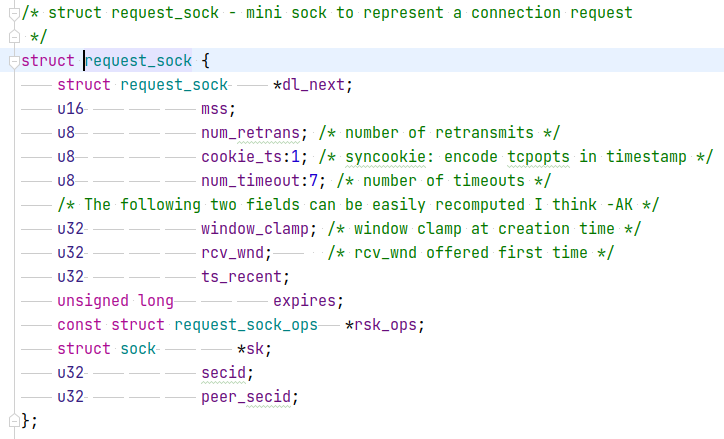

# 理解TCP连接建立过程


* <https://programmer.ink/think/socket-kernel-data-structure.html>


---

## sys_listen


```
/*
 *	Move a socket into listening state.
 */
int inet_listen(struct socket *sock, int backlog)
{
	struct sock *sk = sock->sk;
	unsigned char old_state;
	int err;

	lock_sock(sk);

	err = -EINVAL;
	if (sock->state != SS_UNCONNECTED || sock->type != SOCK_STREAM)
		goto out;

	old_state = sk->sk_state;
	if (!((1 << old_state) & (TCPF_CLOSE | TCPF_LISTEN)))
		goto out;

	/* Really, if the socket is already in listen state
	 * we can only allow the backlog to be adjusted.
	 */
	if (old_state != TCP_LISTEN) {
		/* Check special setups for testing purpose to enable TFO w/o
		 * requiring TCP_FASTOPEN sockopt.
		 * Note that only TCP sockets (SOCK_STREAM) will reach here.
		 * Also fastopenq may already been allocated because this
		 * socket was in TCP_LISTEN state previously but was
		 * shutdown() (rather than close()).
		 */
		if ((sysctl_tcp_fastopen & TFO_SERVER_ENABLE) != 0 &&
		    inet_csk(sk)->icsk_accept_queue.fastopenq == NULL) {
			if ((sysctl_tcp_fastopen & TFO_SERVER_WO_SOCKOPT1) != 0)
				err = fastopen_init_queue(sk, backlog);
			else if ((sysctl_tcp_fastopen &
				  TFO_SERVER_WO_SOCKOPT2) != 0)
				err = fastopen_init_queue(sk,
				    ((uint)sysctl_tcp_fastopen) >> 16);
			else
				err = 0;
			if (err)
				goto out;
		}
		err = inet_csk_listen_start(sk, backlog); // 关键
		if (err)
			goto out;
	}
	sk->sk_max_ack_backlog = backlog; // 关键
	err = 0;

out:
	release_sock(sk);
	return err;
}
EXPORT_SYMBOL(inet_listen);
```


```
struct inet_connection_sock {
	/* inet_sock has to be the first member! */
	struct inet_sock	  icsk_inet;

	struct request_sock_queue icsk_accept_queue; // 全连接、半连接队列

	struct inet_bind_bucket	  *icsk_bind_hash;
	unsigned long		  icsk_timeout;
 	struct timer_list	  icsk_retransmit_timer;
 	struct timer_list	  icsk_delack_timer;
	__u32			  icsk_rto;
	__u32			  icsk_pmtu_cookie;
	const struct tcp_congestion_ops *icsk_ca_ops;
	const struct inet_connection_sock_af_ops *icsk_af_ops;
	unsigned int		  (*icsk_sync_mss)(struct sock *sk, u32 pmtu);
	__u8			  icsk_ca_state;
	__u8			  icsk_retransmits;
	__u8			  icsk_pending;
	__u8			  icsk_backoff;
	__u8			  icsk_syn_retries;
	__u8			  icsk_probes_out;
	__u16			  icsk_ext_hdr_len;
	struct {
		__u8		  pending;	 /* ACK is pending			   */
		__u8		  quick;	 /* Scheduled number of quick acks	   */
		__u8		  pingpong;	 /* The session is interactive		   */
		__u8		  blocked;	 /* Delayed ACK was blocked by socket lock */
		__u32		  ato;		 /* Predicted tick of soft clock	   */
		unsigned long	  timeout;	 /* Currently scheduled timeout		   */
		__u32		  lrcvtime;	 /* timestamp of last received data packet */
		__u16		  last_seg_size; /* Size of last incoming segment	   */
		__u16		  rcv_mss;	 /* MSS used for delayed ACK decisions	   */
	} icsk_ack;
	struct {
		int		  enabled;

		/* Range of MTUs to search */
		int		  search_high;
		int		  search_low;

		/* Information on the current probe. */
		int		  probe_size;
	} icsk_mtup;
	u32			  icsk_ca_priv[16];
	u32			  icsk_user_timeout;
#define ICSK_CA_PRIV_SIZE	(16 * sizeof(u32))
};
```





## sys_connect


```

```


---
